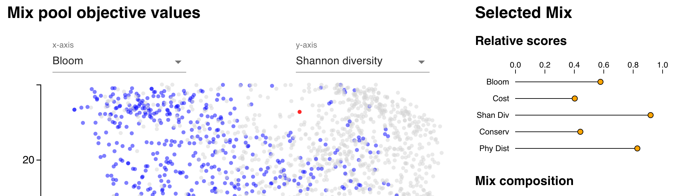

# Data visualization tool

Our principle aim with this computational approach to seed mix design is to improve realized ecological benefits of restoration projects using mixes that produce a range of ecological benefits cost-effectively. In order to get these mixes into the hands of restoration specialists, we are developing a decision-support tool that makes this approach accessible and customizable.

The full tool combines optimization with a "build-a-mix" approach that allows users to customize mixes, either built completely by the user, or by selecting optimized mixes as a starting point and modifying them to fit local conditions or project needs.

Here, we provide a demonstration of the [optimized mix browser](https://phawthorne.github.io/computational-seed-mix-design). This demo illustrates browsing through thousands of optimization outputs to identify mixes that meet desired criteria.

## Demo documentation

### Mix pool objective values
The main panel consists of a scatter plot that shows objective values for every mix in the 25 species, 2500 max cost
run of the optimization. Controls for x- and y-axis allow the user to switch which objective scores are shown. The user
can click on a mix to select it.

### Filters
Filters allow the user to specify acceptable ranges for each of the objectives, which are reflected in the main 
scatter plot by graying out unacceptable mixes.

### Selected mix reports
Once a mix is selected, mix-specific report panels are populated:

- A "relative scores" graphic shows objective values for the selected mix, normalized to a scale of 0-1, 
where 0 corresponds to the lowest value for that objective across all optimized mixes, and 1 corresponds to the highest.
- A table lists the species included in the selected mix, and the quantity of each species, rounded to the nearest ounce.

## Summary
These various interfaces allow the user to explore the large pool of mixes to better understand patterns of tradeoffs
between different objectives, and to identify mixes meeting particular criteria. The larger tool under development
allows the user to export mixes of interest to their account, where they can edit them by adjusting seed weight for
included species, or by adding/removing species, and seeing how these changes affect the objective values with
live updating.